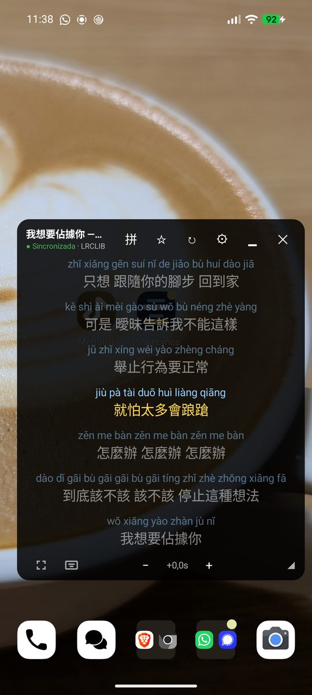
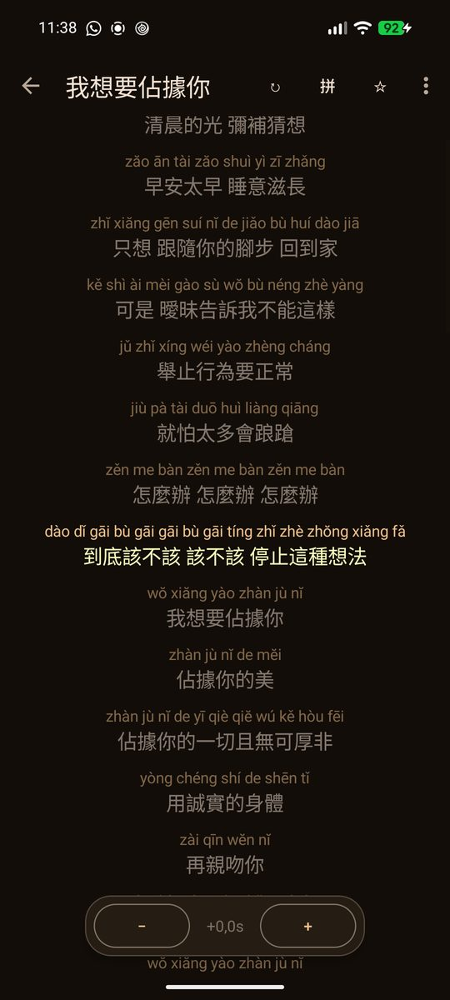
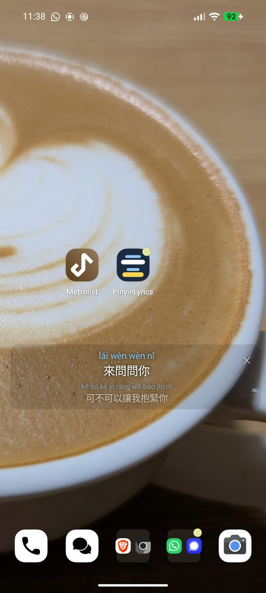
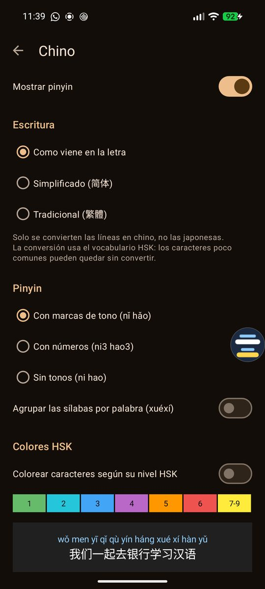

  

# PinyinLyrics

🇬🇧 [English](README.md) · 🇪🇸 **Español**

🌐 [Sitio web](https://pinyin-lyrics.dawei.es/es/) · 🧪 [Únete a la beta](https://groups.google.com/g/pinyinlyrics-testing)

**PinyinLyrics** es una app gratuita para Android que detecta la canción que suena en tu móvil (YouTube Music,
Spotify, etc.), busca su letra y la muestra en una **ventana flotante sobre cualquier app**, con **pinyin** para el
chino y romanización para japonés y coreano.

*A free Android app that detects the song playing on your phone, fetches its lyrics and shows them in a floating
window over any app, with pinyin for Chinese and romanization for Japanese and Korean.*

  
  
  
  

Ventana flotante · Letra a pantalla completa · Modo mini · Ajustes de chino

## Funciones

- Detección automática de la canción que suena. Siempre intenta encontrar primero la **letra sincronizada** y solo
  usa texto plano si no hay ninguna. Una etiqueta indica si la letra está sincronizada, y puedes ajustar el desfase
  ±0,5 s por canción.
- Ventana flotante: se puede mover, redimensionar y reducir a una **burbuja** que se pega al borde de la pantalla
  (tócala para recuperar la letra). Puede abrirse sola al empezar la música y ocultarse al pararla.
- **Letra a pantalla completa:** amplía la letra dentro de la app. Sigue la canción que suena (y cambia sola cuando
  cambia la canción), se puede recargar si no es la correcta, copiar o compartir en hanzi, pinyin o ambos.
- **Modo mini:** solo la línea actual (y la siguiente) sobre un fondo casi transparente; se puede arrastrar y tiene
  una ✕ para cerrarlo. Necesita letra sincronizada y se desactiva solo, con un aviso, si no lo está.
- **¿Letra incorrecta?** Mantén pulsado ↻ para buscar y elegir tú la correcta; la elección se recuerda para esa canción.
- **Buscador de letras** por título o artista, con scroll infinito; **favoritas** (guardadas en tu móvil, con copia
  de seguridad y restauración) y lista de **canciones recientes** en la pantalla principal.
- **Chino:** pinyin por palabras (lecturas correctas en caracteres con varias pronunciaciones), con marcas de tono,
  números o sin tonos; escritura simplificada o tradicional; colores por nivel HSK 3.0.
- **Japonés:** romaji Hepburn (o hiragana), con lectura de los kanji. **Coreano:** Romanización Revisada.
- **Seguir la canción:** la línea actual se amplía con una animación. Haz scroll con libertad y el resaltado vuelve solo
  5 s después; el desplazamiento automático se puede desactivar con un botón. **Toca una línea para saltar** a ese
  momento de la canción.
- **Controles de reproducción** (anterior, pausa, siguiente) en la ventana flotante y **desfase global de sincronización**
  además del de cada canción.
- **Pinyin alineado:** el pinyin se dibuja sobre cada carácter. El **modo práctica** lo oculta en el vocabulario HSK hasta
  el nivel que elijas, para leer solo lo que aún necesitas.
- **Más sistemas de escritura:** zhuyin (bopomofo) y jyutping (cantonés) para chino, hiragana en lugar de romaji para
  japonés. El idioma se detecta por canción.
- **Pega o importa tu propia letra** (texto o `.lrc`) cuando LRCLIB no la tiene, **comparte una línea como imagen** y un
  **mosaico de Ajustes rápidos** para abrir y cerrar la ventana.
- Un botón ↻ para descartar letras erróneas y probar la siguiente, y una lista de apps de música que ignorar.
- Material 3, con modo claro y oscuro según el sistema.
- Disponible en inglés, español, catalán, francés, alemán, portugués, italiano, chino (simplificado y
  tradicional), japonés y coreano.

## Instalar

1. Descarga el APK de la última versión en [**Releases**](../../releases/latest).
2. Ábrelo en el móvil. Android te pedirá permiso para instalar apps desconocidas desde tu navegador o gestor de archivos.
3. Abre PinyinLyrics y concede los permisos que te pide.

Requiere **Android 8.0 o superior**.

### Permisos

| Permiso | Para qué |
|---|---|
| Acceso a notificaciones | Leer el título y el artista de la canción que suena. |
| Mostrar sobre otras apps | Dibujar la ventana flotante con la letra. |

En Android 13 o superior, si el interruptor de "Acceso a notificaciones" aparece en gris, ve a
Ajustes > Apps > PinyinLyrics > ⋮ > *Permitir ajustes restringidos*. Si el modo automático se detiene tras un
rato, quita la restricción de batería a la app: algunos fabricantes cierran los servicios en segundo plano.

## Privacidad

Sin cuentas, anuncios ni analíticas. Para buscar letras, la app envía el **título y el artista** de la canción (o lo
que escribas en el buscador) al servicio de letras (ver abajo). Las favoritas, las canciones recientes
y los ajustes de sincronización se guardan **solo en tu dispositivo** y puedes borrarlos o desactivarlos en Ajustes.
De forma opcional, como mucho una vez al día, la app consulta a GitHub el número de la última versión para avisarte de
las actualizaciones (no se envía ningún dato personal); puedes desactivarlo en Ajustes. Esta comprobación no existe en la versión de Google Play. Nada más sale de tu
dispositivo.

## Aviso sobre las letras

PinyinLyrics **no incluye ni aloja letras**: las consulta, a petición del usuario, en un servicio de terceros y las
muestra en su dispositivo. Las letras tienen copyright de sus titulares.

| Fuente | Estado |
|---|---|
| [LRCLIB](https://lrclib.net) | Servicio abierto y comunitario. |

Este proyecto no está afiliado a LRCLIB ni a ninguna app de música.

## Licencias de terceros

Ver [THIRD_PARTY_NOTICES.md](THIRD_PARTY_NOTICES.md). El mismo aviso está dentro de la app (menú ⋮ > Licencias).
