

  

<h1 align="center">PinyinLyrics</h1>

  <b>Canta en chino, japonés y coreano.</b> 
  Letras con pinyin, romaji y romanización en una ventana flotante sobre cualquier app de música en Android.

  
  

  
  
  
  
  

  🇬🇧 <a href="README.md">English</a> · 🇪🇸 <b>Español</b> · 🧪 <a href="https://groups.google.com/g/pinyinlyrics-testing">Únete a la beta</a>

  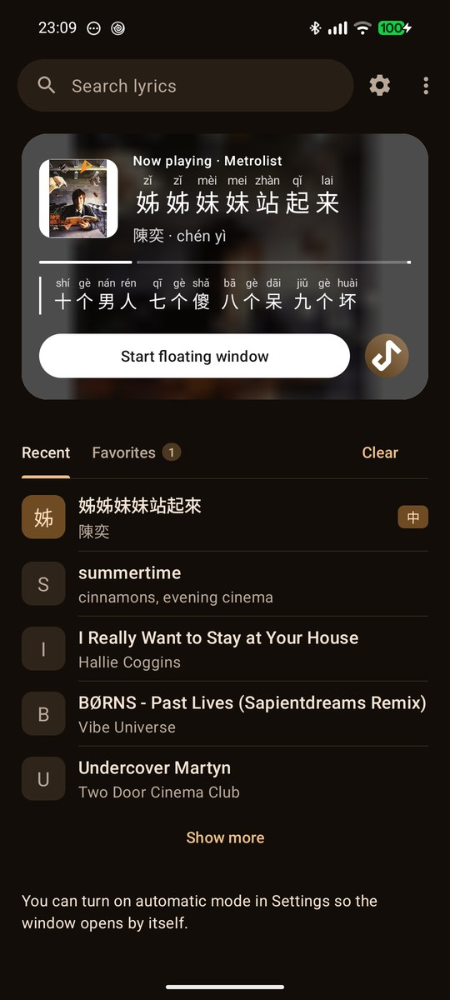
  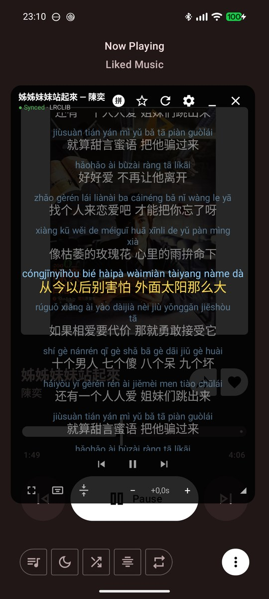
  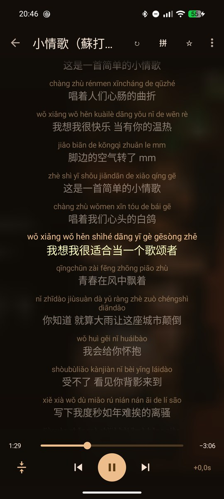
  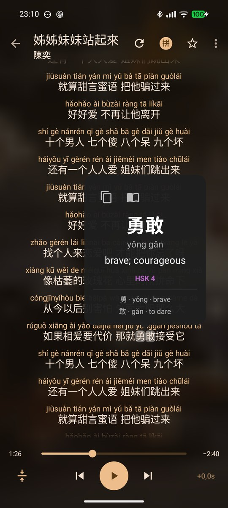

Pantalla principal · Ventana flotante · Letra a pantalla completa · Ficha de palabra <i>(interfaz en inglés)</i>

**PinyinLyrics** es una app gratuita para Android que detecta la canción que suena en tu móvil (YouTube Music,
Spotify, etc.; también la versión gratuita de Spotify), busca su letra y la muestra **sobre cualquier app**, con
**pinyin** para el chino y romanización para japonés y coreano. Está pensada para quien aprende: toca una palabra para
consultarla, colorea la letra por nivel HSK u oculta el pinyin que ya sabes.

## ✨ Lo más destacado

<table>
  <tr>
    <td width="33%" valign="top">🎧 <b>Funciona con tu reproductor</b> Spotify (también gratis), YouTube Music, Metrolist y más. La canción se detecta sola.</td>
    <td width="33%" valign="top">⏱️ <b>Letra sincronizada</b> La línea actual se resalta mientras suena. Toca una línea para saltar a ella.</td>
    <td width="33%" valign="top">🀄 <b>Pinyin sobre cada carácter</b> Lecturas por palabra, con marcas de tono o números, en simplificado o tradicional.</td>
  </tr>
  <tr>
    <td valign="top">📖 <b>Ficha de palabra</b> Toca un carácter: pinyin, significado, nivel HSK y desglose por caracteres.</td>
    <td valign="top">🎯 <b>Modo práctica</b> Oculta el pinyin de las palabras HSK que ya sabes y colorea el resto por nivel.</td>
    <td valign="top">🪟 <b>Ventana flotante</b> Muévela, cámbiala de tamaño, redúcela a una burbuja o usa el modo mini de una línea.</td>
  </tr>
</table>

## 🎵 Funciones

<b>🎧 La letra sigue a tu música</b>

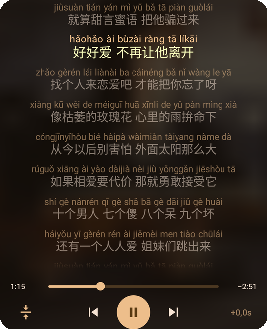

- Detección automática de la canción que suena en **Spotify** (también la versión gratuita: detecta los anuncios y no
  busca letra para ellos), **YouTube Music**, **Metrolist** y más.
- Siempre intenta encontrar primero la **letra sincronizada** y solo usa texto plano si no hay ninguna. Una etiqueta
  indica si la letra está sincronizada.
- **Seguir la canción:** la línea actual se amplía con una animación. Haz scroll con libertad y el resaltado vuelve solo
  5 s después; el desplazamiento automático se puede desactivar con un botón. **Toca una línea para saltar** a ese
  momento de la canción.
- Ajusta el desfase ±0,5 s por canción, y además un **desfase global de sincronización**.
- **Controles de reproducción** (anterior, pausa, siguiente) en la ventana flotante y a pantalla completa.

 

<b>🈶 Chino, japonés y coreano</b>

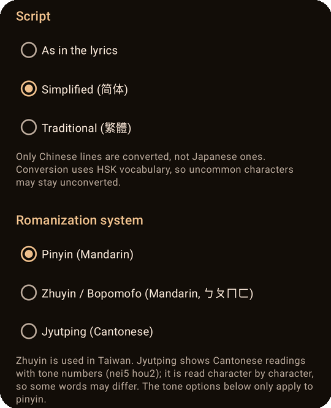

- **Chino:** pinyin por palabras (lecturas correctas en caracteres con varias pronunciaciones), con marcas de tono,
  números o sin tonos; escritura simplificada o tradicional; **zhuyin** (bopomofo) y **jyutping** (cantonés).
- **Japonés:** romaji Hepburn o hiragana, con lectura de los kanji.
- **Coreano:** Romanización Revisada.
- El idioma se detecta por canción.

 
 

  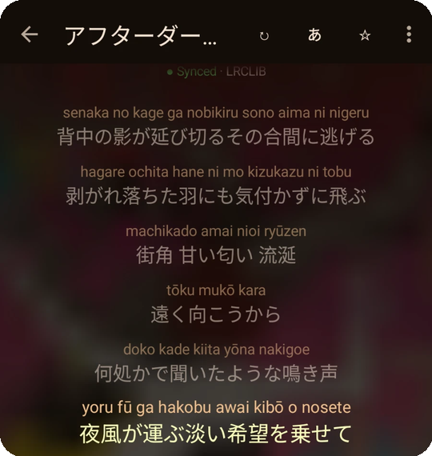
  &nbsp;
  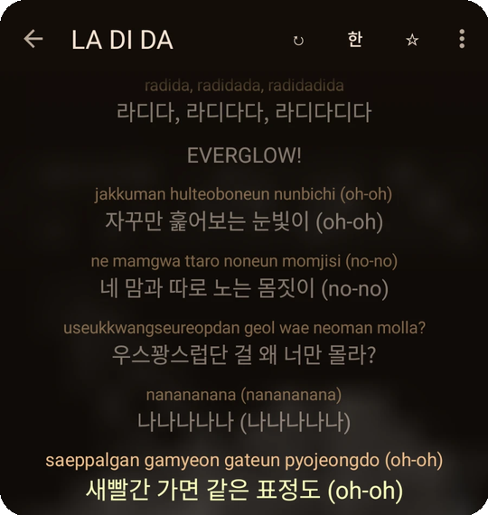

Japonés (romaji) · Coreano (romanización revisada)

<b>📖 Aprende mientras escuchas</b>

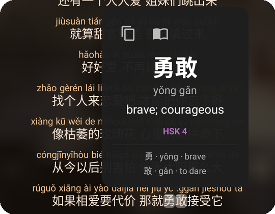

- **Pinyin alineado:** se dibuja sobre cada carácter, no en una línea aparte.
- **Ficha de palabra:** toca un carácter chino en la letra y verás la palabra con pinyin, significado (CC-CEDICT),
  nivel HSK y el desglose carácter a carácter; cópiala o abre tu app de diccionario.
- **Colores por nivel HSK 3.0** y un **modo práctica** que oculta el pinyin en el vocabulario HSK hasta el nivel que
  elijas, para leer solo lo que aún necesitas.
- **Guía para principiantes** en el primer arranque (y en el menú).

 

<b>🪟 Ventana flotante, pantalla completa y modo mini</b>

- **Ventana flotante:** se puede mover, redimensionar y reducir a una **burbuja** que se pega al borde de la pantalla
  (tócala para recuperar la letra). Puede abrirse sola al empezar la música y ocultarse al pararla.
- **Letra a pantalla completa:** sigue la canción que suena, se puede recargar si no es la correcta, copiar o
  compartir en hanzi, pinyin o ambos.
- **Modo mini:** solo la línea actual (y la siguiente) sobre un fondo casi transparente; se puede arrastrar y tiene
  una ✕ para cerrarlo. Necesita letra sincronizada.
- **Mosaico de Ajustes rápidos** para abrir y cerrar la ventana.
- **Pantalla principal:** tarjeta "Ahora suena" con la carátula difuminada y la línea actual, más Recientes y Favoritas.

  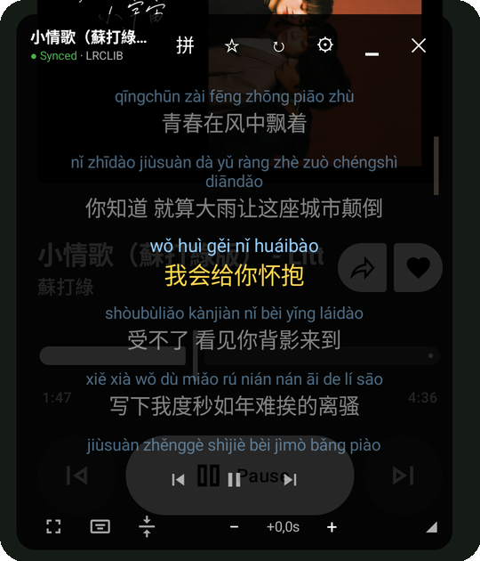
  &nbsp;
  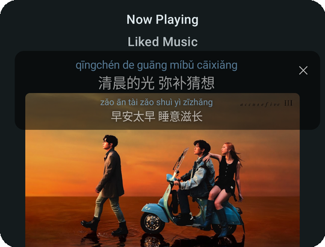

Ventana flotante · Modo mini

 

<b>🛠️ Búsqueda, favoritas y correcciones</b>

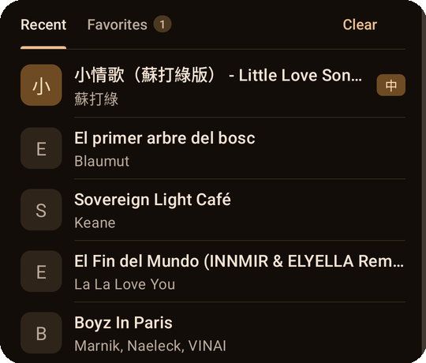

- **Buscador de letras** por título o artista, con scroll infinito.
- **Favoritas** (guardadas en tu móvil, con copia de seguridad y restauración) y **canciones recientes**.
- **¿Letra incorrecta?** Toca ↻ para probar la siguiente, o mantenlo pulsado para buscar y elegir tú la correcta; la
  elección se recuerda para esa canción.
- **Pega o importa tu propia letra** (texto o `.lrc`) cuando ninguna fuente la tiene.
- **Comparte una línea como imagen.**
- Una lista de apps de música que ignorar.
- Material 3, modo claro y oscuro, y la interfaz en 11 idiomas: inglés, español, catalán, francés, alemán,
  portugués, italiano, chino (simplificado y tradicional), japonés y coreano.

 

## 📲 Instalar

1. Descarga [**PinyinLyrics.apk**](https://github.com/DaWy/pinyin-lyrics/releases/latest/download/PinyinLyrics.apk)
   (última versión; todas las versiones están en [Releases](../../releases)).
2. Ábrelo en el móvil. Android te pedirá permiso para instalar apps desconocidas desde tu navegador o gestor de archivos.
3. Abre PinyinLyrics y concede los permisos que te pide.

Requiere **Android 8.0 o superior**.

| Permiso | Para qué |
|---|---|
| Acceso a notificaciones | Leer el título y el artista de la canción que suena. |
| Mostrar sobre otras apps | Dibujar la ventana flotante con la letra. |

> [!TIP]
> En Android 13 o superior, si el interruptor de "Acceso a notificaciones" aparece en gris, ve a
> Ajustes > Apps > PinyinLyrics > ⋮ > *Permitir ajustes restringidos*. Si el modo automático se detiene tras un
> rato, quita la restricción de batería a la app: algunos fabricantes cierran los servicios en segundo plano.

## 🔒 Privacidad

**Sin cuentas, anuncios ni analíticas.** Para buscar letras, la app envía el **título y el artista** de la canción (o
lo que escribas en el buscador) a los servicios de letras (ver abajo). Las favoritas, las canciones recientes y los
ajustes de sincronización se guardan **solo en tu dispositivo** y puedes borrarlos o desactivarlos en Ajustes.
De forma opcional, como mucho una vez al día, la app consulta a GitHub el número de la última versión para avisarte de
las actualizaciones (no se envía ningún dato personal); puedes desactivarlo en Ajustes. Esta comprobación no existe en
la versión de Google Play. Nada más sale de tu dispositivo.

## 📜 Aviso sobre las letras

PinyinLyrics **no incluye ni aloja letras**: las consulta, a petición del usuario, en servicios de terceros y las
muestra en su dispositivo. Las letras tienen copyright de sus titulares.

| Fuente | Estado |
|---|---|
| [LRCLIB](https://lrclib.net) | Fuente principal, con letras sincronizadas. Servicio abierto y comunitario. |
| [lyrics.ovh](https://lyrics.ovh) | Segunda fuente, solo letras sin sincronizar; se consulta después de LRCLIB. |

Este proyecto no está afiliado a LRCLIB, a lyrics.ovh ni a ninguna app de música.

## ☕ Apoya el proyecto

PinyinLyrics es gratis y no tiene anuncios. Si te ayuda a aprender, puedes
[invitarme a un café en Ko-fi](https://ko-fi.com/dawyes).

  

## Licencias de terceros

Ver [THIRD_PARTY_NOTICES.md](THIRD_PARTY_NOTICES.md). El mismo aviso está dentro de la app (menú ⋮ > Licencias).
