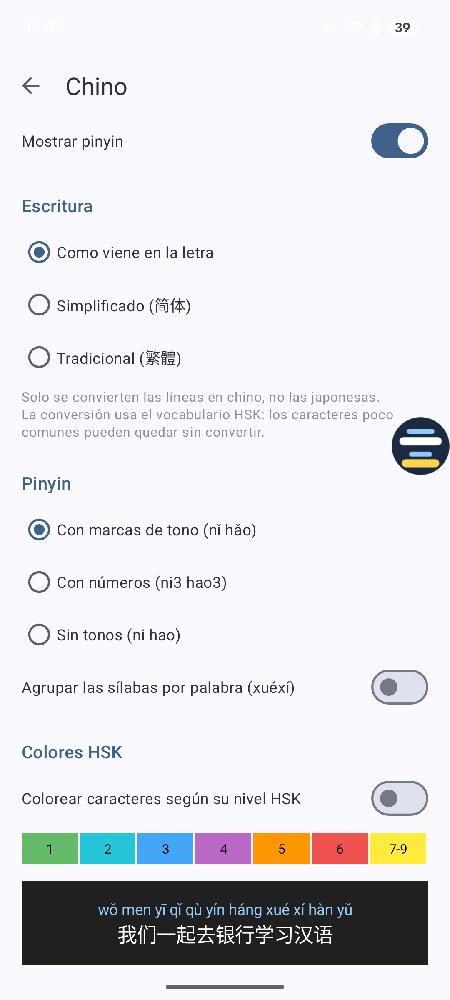
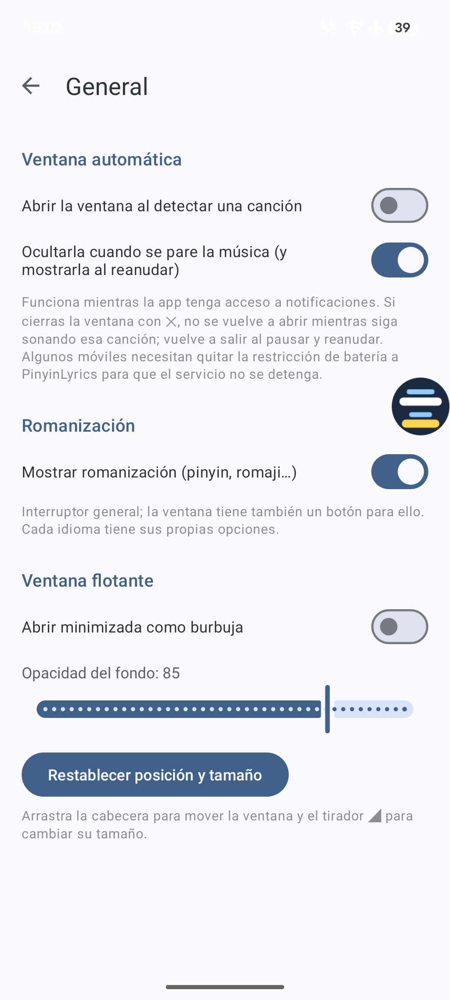

  

# PinyinLyrics

🇬🇧 [English](README.md) · 🇪🇸 **Español**

**PinyinLyrics** es una app gratuita para Android que detecta la canción que suena en tu móvil (YouTube Music,
Spotify, etc.), busca su letra y la muestra en una **ventana flotante sobre cualquier app**, con **pinyin** para el
chino y romanización para japonés y coreano.

*A free Android app that detects the song playing on your phone, fetches its lyrics and shows them in a floating
window over any app, with pinyin for Chinese and romanization for Japanese and Korean.*

  
  
  
  
  

Japonés con romaji · Chino con pinyin · Ajustes

## Funciones

- Detección automática de la canción en reproducción y letra sincronizada resaltada en tiempo real.
- Ventana flotante: arrastrable, redimensionable y minimizable a una **burbuja** pequeña que se pega al borde de la
  pantalla (tócala para volver a ver la letra). Puede abrirse sola al sonar música y ocultarse al parar.
- **Chino:** pinyin por palabras (con la lectura correcta de los caracteres de varias lecturas), con tonos, con
  números o sin tonos; escritura simplificada o tradicional; colores por nivel HSK 3.0.
- **Japonés:** romaji Hepburn, con lectura de los kanji. **Coreano:** romanización revisada.
- Varias fuentes de letras, y un botón ↻ para descartar una letra incorrecta y probar la siguiente.
- Material 3, con modo claro y oscuro según el sistema.
- Disponible en inglés, español, catalán, francés, alemán, portugués, italiano, chino (simplificado y tradicional),
  japonés y coreano.

## Instalar

1. Descarga el APK de la última versión en [**Releases**](../../releases/latest).
2. Ábrelo en el móvil. Android te pedirá permiso para instalar apps desconocidas desde tu navegador o gestor de archivos.
3. Abre PinyinLyrics y concede los permisos que te pide.

Requiere **Android 8.0 o superior**.

### Permisos

| Permiso | Para qué |
|---|---|
| Acceso a notificaciones | Leer el título y el artista de la canción que suena. |
| Mostrar sobre otras apps | Dibujar la ventana flotante con la letra. |

En Android 13 o superior, si el interruptor de "Acceso a notificaciones" aparece en gris, ve a
Ajustes > Apps > PinyinLyrics > ⋮ > *Permitir ajustes restringidos*. Si el modo automático se detiene tras un
rato, quita la restricción de batería a la app: algunos fabricantes cierran los servicios en segundo plano.

## Privacidad

No hay cuentas, publicidad ni analíticas. Para buscar una letra, la app envía el **título y el artista** de la
canción a los servicios de letras configurados (ver abajo). Nada más sale del dispositivo.

## Aviso sobre las letras

PinyinLyrics **no incluye ni aloja letras**: las consulta, a petición del usuario, en servicios de terceros y las
muestra en su dispositivo. Las letras tienen copyright de sus titulares.

| Fuente | Estado |
|---|---|
| [LRCLIB](https://lrclib.net) | Servicio abierto y comunitario. |
| NetEase Cloud Music, Kugou Music | Endpoints **no oficiales**, usados sin acuerdo con esos servicios; pueden dejar de funcionar. |
| Lyrics.ovh | Servicio de terceros, solo texto. |

Este proyecto no está afiliado a ninguno de estos servicios ni a ninguna app de música.

## Licencias de terceros

Ver [THIRD_PARTY_NOTICES.md](THIRD_PARTY_NOTICES.md). El mismo aviso está dentro de la app (menú ⋮ > Licencias).
