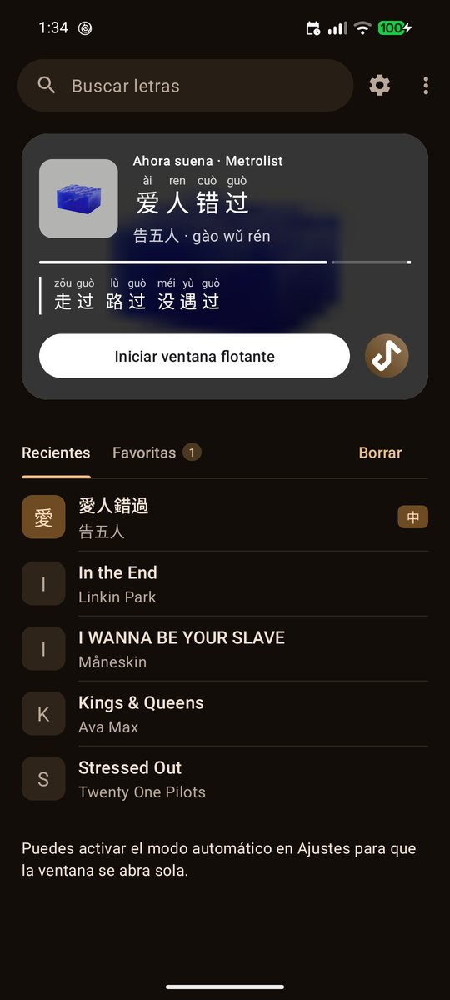
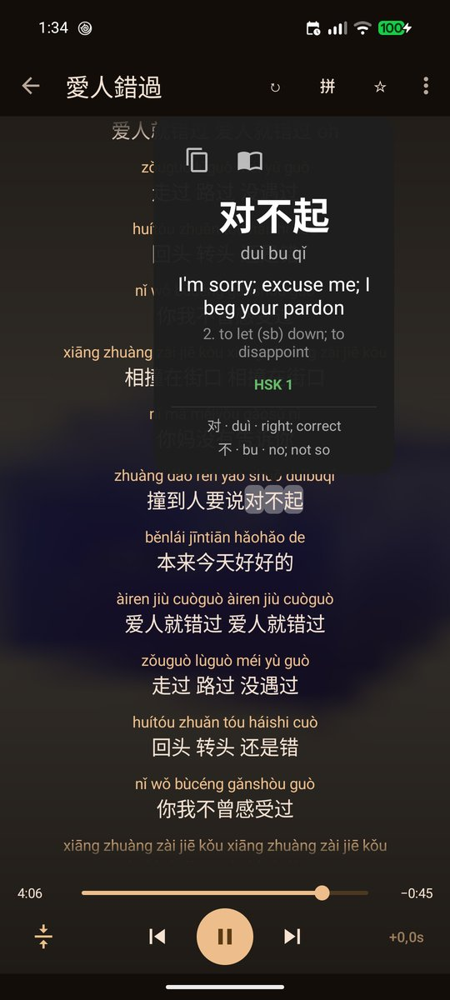

  

# PinyinLyrics

🇬🇧 **English** · 🇪🇸 [Español](README.es.md)

🌐 [Website](https://pinyin-lyrics.dawei.es/) · 🧪 [Join the beta](https://groups.google.com/g/pinyinlyrics-testing)

**PinyinLyrics** is a free Android app that detects the song playing on your phone (YouTube Music, Spotify,
etc.; free Spotify too), looks up its lyrics and shows them in a **floating window over any app**, with **pinyin** for Chinese and
romanization for Japanese and Korean.

  
  
  
  

Home screen · Floating window · Full-screen lyrics · Word card (screenshots shown with the Spanish interface)

## Features

- **New home screen:** a "Now playing" card with blurred cover art, the title with pinyin above each character,
  progress and the current lyric line; a button with the player's icon to jump back to it; Recents and Favorites in
  tabs. If a song has no lyrics, it offers to search for them or paste your own.
- **Word card:** tap a Chinese character in the lyrics to see the word with pinyin, meaning (CC-CEDICT), HSK level and
  a character-by-character breakdown; copy it or open your dictionary app.
- **Beginner's guide** on first launch (and in the menu).
- **Works with your player:** Spotify (also the free version: it detects ads and doesn't look up lyrics for them),
  YouTube Music, Metrolist and more.
- Automatic detection of the song that is playing. It always tries to find **synced lyrics** first, and falls back to
  plain text only if there are none. A badge shows whether the lyrics are synced, and you can nudge the timing
  ±0.5 s per song.
- Floating window: draggable, resizable, and it can shrink to a small **bubble** that snaps to the screen edge (tap it to
  bring the lyrics back). It can open by itself when music starts and hide when it stops.
- **Full-screen lyrics:** expand the lyrics inside the app. They follow the song that is playing (and switch by
  themselves when the song changes), can be reloaded if they're wrong, copied or shared as Hanzi, pinyin or both.
- **Mini mode:** just the current line (and the next one) over a nearly transparent background; draggable, with a ✕
  to close it. It needs synced lyrics, and turns itself off with a notice if they aren't.
- **Wrong lyrics?** Long-press ↻ to search and pick the right ones yourself; your choice is remembered for that song.
- **Lyrics search** by title or artist, with endless scrolling, plus **favorites** (saved on your phone, with backup
  and restore) and a list of **recently played** songs on the home screen.
- **Chinese:** pinyin by word (correct readings for characters with several pronunciations), with tone marks,
  numbers or no tones; simplified or traditional script; colors by HSK 3.0 level.
- **Japanese:** Hepburn romaji (or hiragana), with kanji readings. **Korean:** Revised Romanization.
- **Follow along:** the current line is enlarged with an animation. Scroll freely and the highlight returns by itself
  5 s later; auto-scroll can be turned off with a button. **Tap a line to jump** to that moment in the song.
- **Playback controls** (previous, pause, next) in the floating window, and a **global sync offset** on top of the
  per-song one.
- **Aligned pinyin:** pinyin is drawn above each character. **Practice mode** hides it for HSK words up to the level you
  choose, so you only read what you still need.
- **More writing systems:** zhuyin (bopomofo) and jyutping (Cantonese) for Chinese, hiragana instead of romaji for
  Japanese. The language is detected per song.
- **Paste or import your own lyrics** (text or `.lrc`) when neither source has them, **share a line as an image**, and a
  **Quick Settings tile** to open and close the window.
- A ↻ button to discard wrong lyrics and try the next match, and a list of music apps to ignore.
- Material 3, with light and dark mode following the system.
- Available in English, Spanish, Catalan, French, German, Portuguese, Italian, Chinese (Simplified and
  Traditional), Japanese and Korean.

## Install

1. Download the APK from the latest version on the [**Releases**](../../releases/latest) page.
2. Open it on your phone. Android will ask you to allow installing apps from unknown sources for your browser or
   file manager.
3. Open PinyinLyrics and grant the permissions it asks for.

Requires **Android 8.0 or later**.

### Permissions

| Permission | What it is for |
|---|---|
| Notification access | Reading the title and artist of the song that is playing. |
| Display over other apps | Drawing the floating lyrics window. |

On Android 13 or later, if the "Notification access" switch is greyed out, go to
Settings > Apps > PinyinLyrics > ⋮ > *Allow restricted settings*. If automatic mode stops working after a while,
remove the battery restriction for the app: some manufacturers kill background services.

## Privacy

No accounts, ads or analytics. To look up lyrics, the app sends the song's **title and artist** (or what you type in
the search box) to the lyrics services (see below). Favorites, recent songs and sync adjustments are stored
**only on your device** and can be cleared or turned off in Settings. Optionally, once a day at most, the app asks
GitHub for the latest release number to tell you about updates (no personal data is sent); you can turn this off in
Settings. This check is not present in the Google Play version. Nothing else leaves your device.

## About the lyrics

PinyinLyrics **does not include or host any lyrics**: at the user's request it looks them up on third-party
services and shows them on the user's device. Lyrics are copyrighted by their owners.

| Source | Status |
|---|---|
| [LRCLIB](https://lrclib.net) | Main source, with synced lyrics. Open, community-run service. |
| [lyrics.ovh](https://lyrics.ovh) | Second source, unsynced lyrics only; queried after LRCLIB. |

This project is not affiliated with LRCLIB, lyrics.ovh or any music app.

## Third-party licenses

See [THIRD_PARTY_NOTICES.md](THIRD_PARTY_NOTICES.md). The same notice is available inside the app (menu ⋮ > Licenses).
