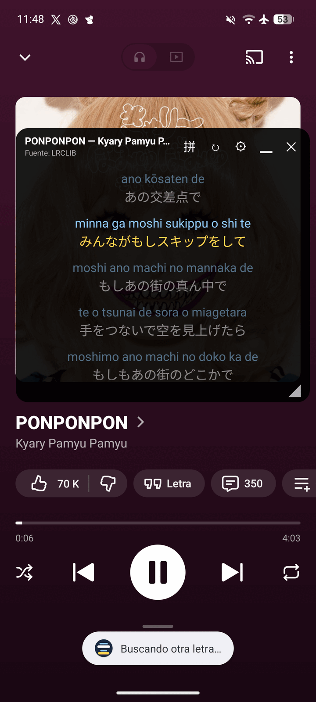
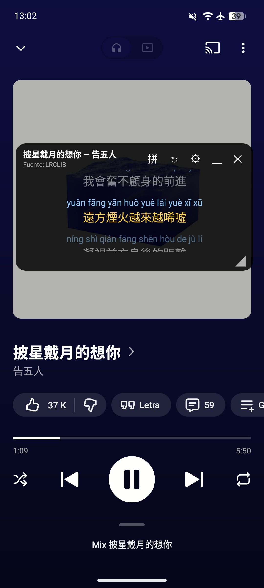
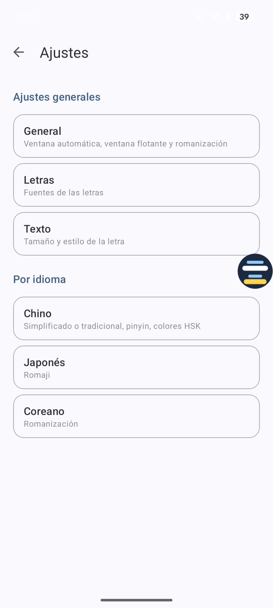

# PinyinLyrics

🇬🇧 **English** · 🇪🇸 [Español](#español)

A free Android app that detects the song playing on your phone (YouTube Music, Spotify, etc.), finds its lyrics and
shows them in a **floating window over any app**, with **pinyin** for Chinese and romanization for Japanese and Korean.

  
  
  

## What it does

- **Detects the song automatically** and shows synced lyrics highlighted in real time.
- **Floating window** you can move, resize or shrink to a bubble. It can open by itself when music starts.
- **Chinese:** pinyin with tone marks, word by word, with HSK level highlighting and a simplified/traditional switch.
- **Japanese:** romaji with kanji readings. **Korean:** Revised Romanization.
- **Search lyrics** by title or artist, pick the right ones if the first match is wrong, and save **favorites**.
- Available in 11 languages. No accounts, no ads, no analytics.

Lyrics are provided by [LRCLIB](https://lrclib.net). PinyinLyrics does not host any lyrics and is not affiliated with LRCLIB or any music app.

[Privacy policy](privacy-policy/) · [GitHub](https://github.com/DaWy/pinyin-lyrics)

---

# Español

Una app de Android gratuita que detecta la canción que suena en tu móvil (YouTube Music, Spotify, etc.), busca su letra
y la muestra en una **ventana flotante sobre cualquier app**, con **pinyin** para chino y romanización para japonés y coreano.

## Qué hace

- **Detecta la canción automáticamente** y muestra la letra sincronizada resaltada en tiempo real.
- **Ventana flotante** que puedes mover, redimensionar o reducir a una burbuja. Puede abrirse sola al sonar música.
- **Chino:** pinyin con tonos, palabra por palabra, con resaltado por nivel HSK y cambio entre simplificado y tradicional.
- **Japonés:** romaji con la lectura de los kanji. **Coreano:** romanización revisada.
- **Busca letras** por título o artista, elige la correcta si la primera no lo es y guarda **favoritas**.
- Disponible en 11 idiomas. Sin cuentas, sin anuncios, sin analíticas.

Las letras las proporciona [LRCLIB](https://lrclib.net). PinyinLyrics no aloja letras y no está afiliada a LRCLIB ni a ninguna app de música.

[Política de privacidad](privacy-policy/) · [GitHub](https://github.com/DaWy/pinyin-lyrics)
